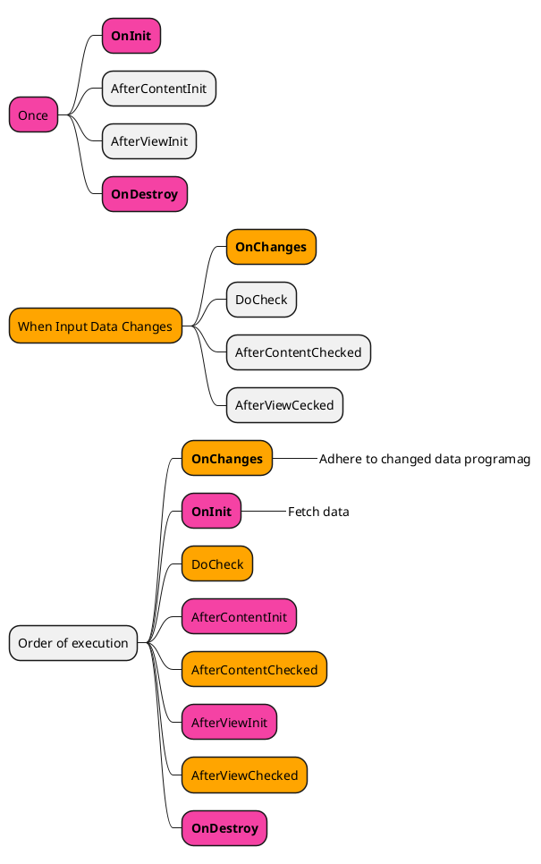

```plantuml
@startmindmap "Once"
*[#f542a4] Once
**[#f542a4] **OnInit**
** AfterContentInit
** AfterViewInit
**[#f542a4] **OnDestroy**
*[#Orange] When Input Data Changes
**[#Orange] **OnChanges**
** DoCheck
** AfterContentChecked
** AfterViewCecked
* Order of execution
**[#Orange] **OnChanges**
***_ Adhere to changed data programag
**[#f542a4] **OnInit**
***_ Fetch data
**[#Orange] DoCheck
**[#f542a4] AfterContentInit
**[#Orange] AfterContentChecked
**[#f542a4] AfterViewInit
**[#Orange] AfterViewChecked
**[#f542a4] **OnDestroy**
@endmindmap

```

 